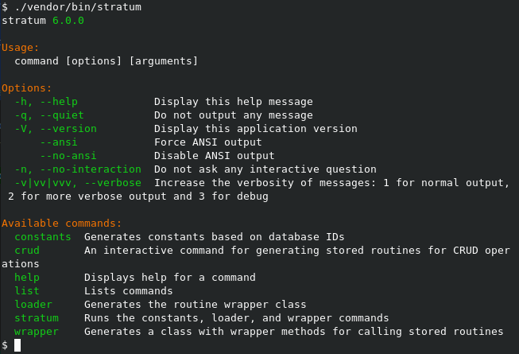

.. php-stratum-program:

The PhpStratum Program
======================

The PhpStratum program is a `Symphony console application`_  with five additional commands:

 * ``constants``
 * ``crud``
 * ``loader``
 * ``stratum``
 * ``wrapper``

We discuss the additional commands in the sections below.

Some commands provide additional output when in verbose mode (``-v``). All commands show the queries been executed in very verbose mode (``-vv``).

The ``constants`` command
-------------------------

The ``crud`` command
--------------------

The ``loader`` command
----------------------

The ``stratum`` command
-----------------------

The ``wrapper`` command
-----------------------

.. _`Symphony console application`: https://symfony.com/doc/current/components/console.html
